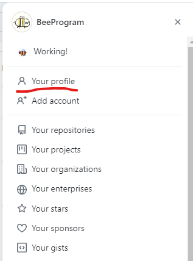
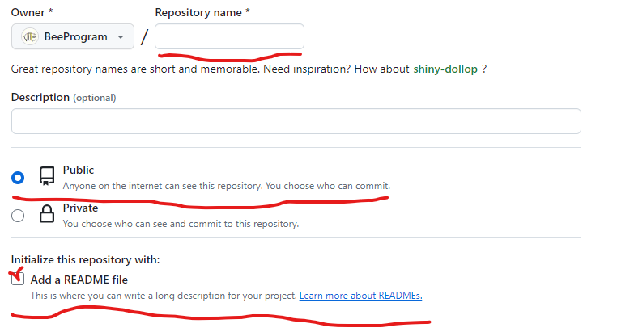
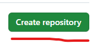
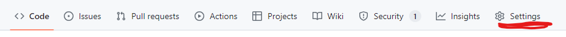
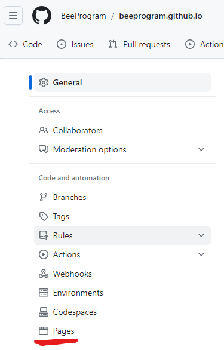
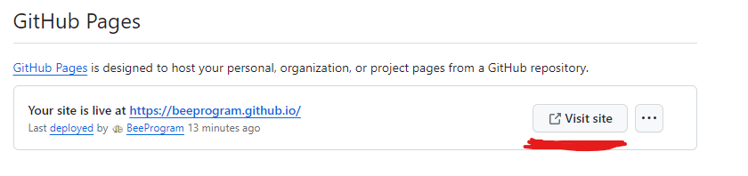

## Подготовка
Для начала необходимо скачать Visual Studio Code (VS Code), следуйте этим шагам:

1. Откройте ваш веб-браузер и перейдите на официальный сайт VS Code: [https://code.visualstudio.com/](https://code.visualstudio.com/).

2. На главной странице вы увидите кнопку "Download for Windows" (если у вас Windows), "Download for macOS" (если у вас macOS), или "Download for Linux" (если у вас Linux). Нажмите соответствующую кнопку в зависимости от вашей операционной системы.

3. После нажатия, файл установки (обычно с расширением .exe для Windows, .dmg для macOS и .deb, .rpm или другим для Linux) начнет загружаться.

4. Как только загрузка завершится, запустите файл установки, следуя инструкциям на экране.

5. В процессе установки, вам могут предложить выбрать опции, такие как добавление ярлыка на рабочий стол или интеграция с контекстным меню. Выберите опции, которые соответствуют вашим предпочтениям.

6. После завершения установки, запустите Visual Studio Code. Теперь у вас должен быть установленный и готовый к использованию редактор кода.

Теперь у вас есть Visual Studio Code на вашем компьютере, и вы можете начать создавать и редактировать файлы кода.

## GitHub
Для наших занятий также необходимо подготовить гит хаб.
Регистрация на GitHub довольно проста и занимает всего несколько шагов. Вот пошаговая инструкция:

1. **Откройте сайт GitHub:**
   Перейдите по адресу https://github.com/ в веб-браузере.

2. **Выберите "Sign up" (Зарегистрироваться):**
   На главной странице GitHub найдите кнопку "Sign up" и нажмите на нее.

3. **Заполните регистрационную форму:**
   Вам потребуется ввести следующую информацию:
   - **Username (Имя пользователя):** Это будет вашим уникальным именем на GitHub. Выберите его так, чтобы его еще не использовал никто другой.
   - **Email address (Адрес электронной почты):** Введите ваш действующий адрес электронной почты.
   - **Password (Пароль):** Выберите надежный пароль.

4. **Подтвердите свой аккаунт:**
   - Пройдите проверку "I'm not a robot" (Я не робот), если она предложена.
   - Вам может потребоваться подтвердить свой адрес электронной почты. GitHub отправит вам письмо с подтверждением. Откройте письмо и выполните инструкции для подтверждения адреса.

5. **Завершите регистрацию:**
   - После подтверждения электронной почты и выбора плана, вы завершите процесс регистрации.

Теперь у вас есть учетная запись на GitHub, и вы можете приступить к созданию репозиториев, участию в проектах и работе с другими разработчиками.

Для дальнейшей работы с GitHub нужен Git.
Установка Git может отличаться в зависимости от вашей операционной системы. Ниже представлены инструкции для установки Git на различных платформах:

### 1. **Установка Git на Windows:**

#### Через официальный инсталлятор:

1. Перейдите на официальный сайт Git: https://git-scm.com/.
2. Нажмите на кнопку "Download for Windows".
3. Запустите скачанный файл и следуйте инструкциям мастера установки.
4. Выберите стандартные опции, если не уверены в том, что вам нужно что-то изменить.
5. После завершения установки, откройте командную строку (Command Prompt) и введите `git --version`, чтобы убедиться, что Git успешно установлен.

### 2. **Установка Git на macOS:**

#### Через Homebrew:

1. Откройте Terminal.
2. Установите Homebrew, если у вас его еще нет, следуя инструкциям на https://brew.sh/.
3. После установки Homebrew, выполните команду `brew install git`.
4. Подтвердите установку, если вас об этом попросят.
5. После завершения установки, введите `git --version`, чтобы проверить, что Git успешно установлен.

### 3. **Установка Git на Linux (Ubuntu):**

#### Через APT:

1. Откройте терминал.
2. Выполните команды:
   ```bash
   sudo apt update
   sudo apt install git
   ```
3. Подтвердите установку, если вас об этом попросят.
4. После завершения установки, введите `git --version`, чтобы проверить, что Git успешно установлен.

### Последние шаги (для всех платформ):

1. После успешной установки, настройте ваше имя и email, выполнив следующие команды:
   ```bash
   git config --global user.name "Ваше Имя"
   git config --global user.email "ваш@example.com"
   ```
   Это необходимо для идентификации ваших коммитов.

2. Теперь Git установлен и настроен на вашем компьютере.

Если у вас возникли какие-либо трудности или вам нужна дополнительная помощь, обратитесь к [официальной документации Git](https://git-scm.com/doc) или в коменты.

## Подготовка репозитория

Если у вас всё получилось, открываем свой гит и переходим в профиль. Для начало откройте меню, оно на этой панели справа.  
  
Теперь в меню выбераем пункт профиль.  
  
Мы в профиле, но наша цель подготовить репозиторий, продолжаем. На панели ниже выбираем репозитории, переходим к созданию.  
  
Нажимаем зелёную кнопку  
  
Теперь заполняем форму данными. Название репозитория - Repository name *, обязательно делаем публичным, и ставим галочку add a README file  
  
Нажимаем зелёную кнопку  
  
Теперь репозиторий создан, но это ещё не всё, надо получить ссылку на наш сайт. Для этого переходим в настройки.  
  
Теперь ищем пункт Pages, переходим в этот раздел.  
  
И нажав на кнопку ниже получим ссылку на наш сайт.  
  

Внимательно пройдитесь по всем пунктам и подготовте среду для обучения. Удачи 😤